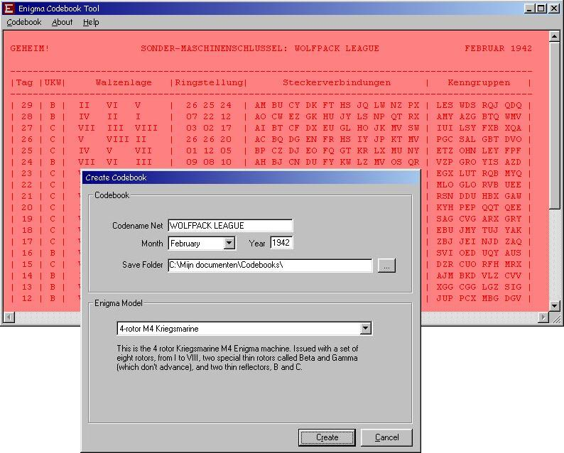

## Enigma Codebook Tool v2\.0

### Description

With this Enigma Codebook Tool, you can create code sheets with key settings for different models of German Enigma cipher machines. (if you're woundering what Enigma is, check out PSC's "Enigma Real Version") You can use these sheets to communicate with groups of other Enigma users. Seems there was a demand in the SH3 gamescene for a codebook generator that could also produce settings for the Kriegsmarine M4. Enigma Codebook Tool provides all necessary information to setup your Enigma. The program can create, show, save and print single code sheets, valid for one month, or a complete year. This tool can create codebooks for the 3-rotor Wehrmach/Luftwaffe Enigma, the 3-rotor Kriegsmarine M3, also called Funkschlussel M, and the 4-rotor Kriegsmarine M4. You can also select two M4 type sheets that are compatible with the M3 or Wehrmach/Luftwaffe models. The program generates random settings, depending the model, for the eight different normal and two special Beta and Gamma rotors, for both wide and thin reflectors, ringsettings and plugboard connections. The program has a clear and simple userinterface to view existing and create new sheets. *** Updated 11/13: fixed number of plugs, landscape printout with frames *** (Latest version also on my website) All comments or feedback most welcome. Have fun with it!
 
### More Info
 

             |
---                |---
**Submitted On**   |2005-11-12 23:35:18
**By**             |[D\. Rijmenants](https://github.com/Planet-Source-Code/PSCIndex/blob/master/ByAuthor/d-rijmenants.md)
**Level**          |Beginner
**User Rating**    |5.0 (15 globes from 3 users)
**Compatibility**  |VB 5\.0, VB 6\.0
**Category**       |[Encryption](https://github.com/Planet-Source-Code/PSCIndex/blob/master/ByCategory/encryption__1-48.md)
**World**          |[Visual Basic](https://github.com/Planet-Source-Code/PSCIndex/blob/master/ByWorld/visual-basic.md)
**Archive File**   |[Enigma\_Cod19480211132005\.zip](https://github.com/Planet-Source-Code/d-rijmenants-enigma-codebook-tool-v2-0__1-63235/archive/master.zip)

